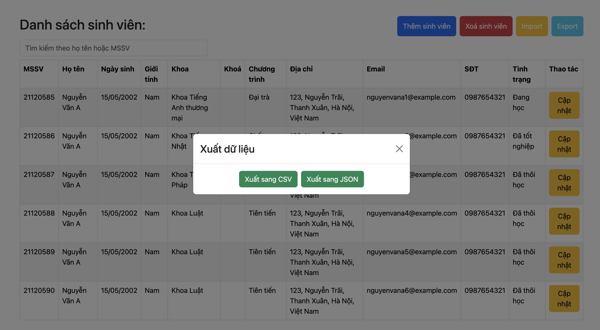

# Cách chạy chương trình:

- Tạo database trống ở MongoDB Atlas
- Truy cập vào folder backend, cài đặt các dependencies: **npm install**
- Tạo file **.env** như hướng dẫn.
- Khởi tạo database bằng lệnh: **node seed.js**
- Chạy server bằng lệnh: **npm run dev**

# Request body mẫu để tạo Student

```json
{
  "studentId": "21120585",
  "fullName": "Nguyễn Văn A",
  "dateOfBirth": "2002-05-15",
  "gender": "Nam",
  "faculty": "67dc02652ee5b77fb929f47a",
  "program": "67dc02652ee5b77fb929f486",
  "studentStatus": "67dc02652ee5b77fb929f480",
  "addresses": {
    "permanent": {
      "houseNumber": "123",
      "street": "Nguyễn Trãi",
      "district": "Thanh Xuân",
      "city": "Hà Nội",
      "country": "Việt Nam"
    },
    "temporary": {
      "houseNumber": "45",
      "street": "Lê Lợi",
      "district": "Hải Châu",
      "city": "Đà Nẵng",
      "country": "Việt Nam"
    },
    "mailing": {
      "houseNumber": "123",
      "street": "Nguyễn Trãi",
      "district": "Thanh Xuân",
      "city": "Hà Nội",
      "country": "Việt Nam"
    }
  },
  "idDocument": {
    "type": "CCCD",
    "idNumber": "123456789012",
    "issuedDate": "2015-06-20",
    "expiryDate": "2035-06-20",
    "issuedPlace": "Cục quản lý xuất nhập cảnh",
    "hasChip": true
  },
  "email": "nguyenvana@example.com",
  "phoneNumber": "0987654321",
  "nationality": "Việt Nam"
}
```
#Hướng dẫn sử dụng
**Version 2.0**.

1. Import dữ liệu từ JSON.
- Chọn định dạng JSON để nhập dữ liệu sinh viên.


- Chọn file JSON muốn sử dụng.


- Sau khi chọn xong nhấn "Nhập dữ liệu".
- Quay trở lại trang chủ.

2. Export dữ liệu về dạng CSV/JSON.
- Quay lại trang chủ.
- Lựa chọn "Export" bên góc phải màn hình.
