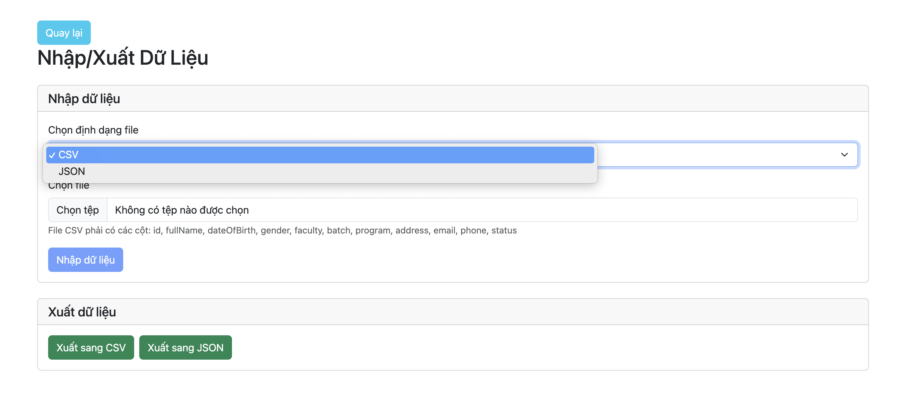
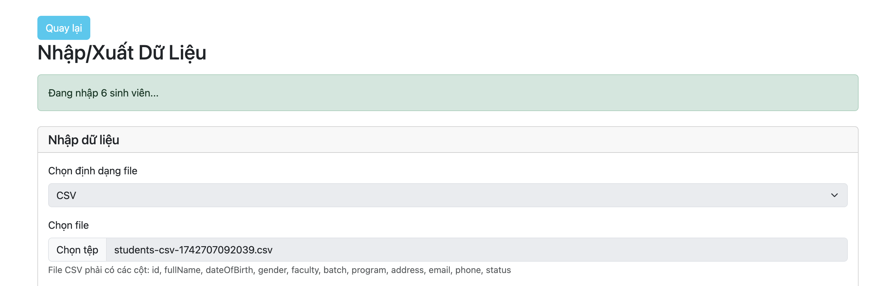
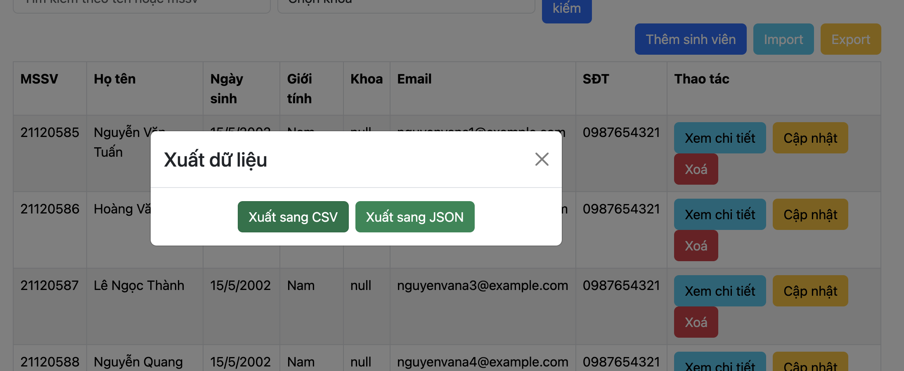
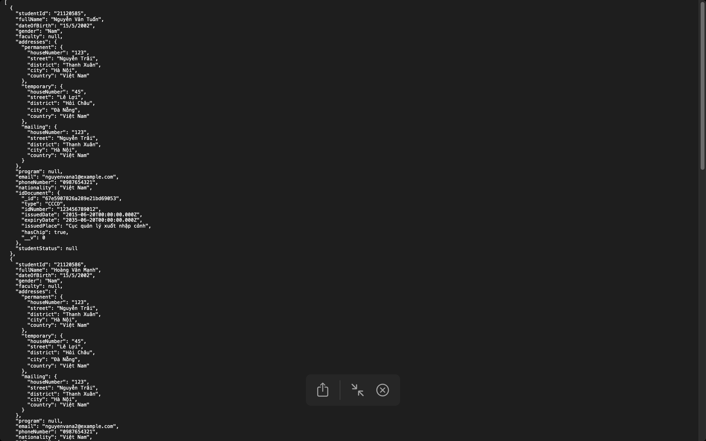
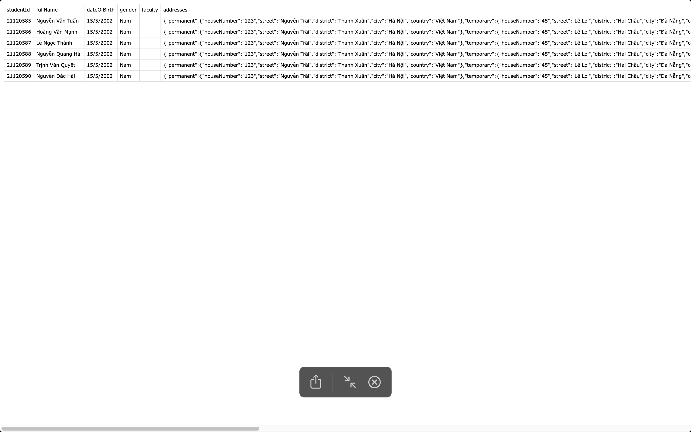

# Cách chạy chương trình:

## Cách chạy server Backend

- Tạo database trống ở MongoDB Atlas
- Truy cập vào folder backend
  ```sh
  cd backend
  ```
- Cài đặt các dependencies:
  ```sh
  npm install
  ```
- Tạo file **.env** như hướng dẫn ở **.env.example**
- Khởi tạo database bằng lệnh:
  ```sh
  node seed.js
  ```
- Chạy server bằng lệnh:
  ```sh
  npm run dev
  ```

### Request body mẫu với email và số điện thoại hợp lệ với business rules được định nghĩa sẵn khi seed database

```json
{
  "idDocument": {
    "type": "CMND",
    "idNumber": "12222",
    "issuedDate": "2025-02-25T00:00:00.000Z",
    "expiryDate": "2025-03-15T00:00:00.000Z",
    "issuedPlace": "vn",
    "issuedCountry": "",
    "hasChip": false,
    "notes": ""
  },
  "studentId": "123123",
  "fullName": "sdfsdf",
  "dateOfBirth": "2025-02-27T00:00:00.000Z",
  "gender": "Nam",
  "faculty": "67e5a7c42db9afe18c54dd3e",
  "program": "67e5a7c42db9afe18c54dd43",
  "studentStatus": "67e5a7c42db9afe18c54dd4f",
  "addresses": {
    "permanent": {
      "houseNumber": "l;kj;lkj",
      "street": ";lkj",
      "district": ";lkj",
      "city": ";l",
      "country": "kj"
    },
    "temporary": {
      "houseNumber": ";lkj",
      "street": ";lk",
      "district": "j",
      "city": ";lkj",
      "country": ";lkj"
    },
    "mailing": {
      "houseNumber": "dfvfdg",
      "street": "l;kjl;kj",
      "district": "l;kj",
      "city": "l;kjl;kj",
      "country": "sdf"
    }
  },
  "email": "test100@university.edu.vn",
  "phoneNumber": "0901234567",
  "nationality": "kjlh"
}
```

### Các endpoint của API

| Endpoint                  | Chức năng                              |
| ------------------------- | -------------------------------------- |
| `/api/students`           | Quản lý sinh viên                      |
| `/api/faculties`          | Quản lý khoa                           |
| `/api/programs`           | Quản lý chương trình học               |
| `/api/student-statuses`   | Quản lý Trạng thái sinh viên           |
| `/api/email-configs`      | Cấu hình email                         |
| `/api/phone-configs`      | Cấu hình số điện thoại                 |
| `/api/status-transitions` | Cấu hình thay đổi trạng thái sinh viên |

## Cách chạy server Frontend

### Cài đặt

1. Mở terminal và điều hướng đến thư mục frontend của dự án.
   ```sh
   cd frontend
   ```
2. Chạy lệnh sau để cài đặt các phụ thuộc:
   ```sh
   npm install
   ```

### Chạy chương trình

1. Tạo file **.env** như hướng dẫn ở **.env.example**
2. Để chạy ứng dụng ở chế độ phát triển, sử dụng lệnh:
   ```sh
   npm run dev
   ```
3. Mở trình duyệt và truy cập vào URL được cung cấp bởi terminal (thường là `http://localhost:5173`).

### Biên dịch

1.  Để biên dịch ứng dụng cho môi trường sản xuất, sử dụng lệnh:
    ```sh
    npm run build
    ```

## Hình ảnh minh hoạ tính năng

- Thêm sinh viên mới:
  [ADD-NEW-STUDENT](https://drive.google.com/file/d/12bm2igDFDUMIO5fb9F3xoHoDRyLnMLWO/view?usp=sharing)
- Xóa sinh viên:
  [DELETE-STUDENT](https://drive.google.com/file/d/1UYNcsLooTZ2X9my8amH0emtnqPaUjIDW/view?usp=sharing)
- Cập nhật thông tin sinh viên:
  [UPDATE-STUDENT](https://drive.google.com/file/d/1DfrFU6bRsa8KpmoEHDj0IPdvdUx0LOh2/view?usp=sharing)
- Tìm kiếm sinh viên:
  [SEARCH-STUDENT](https://drive.google.com/file/d/1BkgsIwPPkboWCbje2V7kZqGJQvyh2Ssd/view?usp=sharing)
- Cho phép đổi tên & thêm mới: khoa, tình trạng sinh viên, chương trình:
  [MANAGE-FACULTY](https://drive.google.com/file/d/1unebPH5v1kGXTA6aI4nB2ynR5X-2I9Dn/view?usp=sharing),
  [MANAGE-STUDENT-STATUS](https://drive.google.com/file/d/1aaMcZhb7DljRADF1DqAANpTwT3A371Ml/view?usp=sharing),
  [MANAGE-PROGRAM](https://drive.google.com/file/d/1KEIc-8wF4_WsxhmUB19149g1lNgL9Shr/view?usp=sharing)

- import JSON file:
  

- import CSV file:
  

- export:
  

  - export JSON:
    

  - export CSV:
    
- Các business rules:
  [CONFIG-EMAIL-DOMAIN](https://drive.google.com/file/d/1SjobgUnJRVjRM1q3-gH48MOwIYHOuqYL/view?usp=sharing),
  [CONFIG-PHONE](https://drive.google.com/file/d/1F1JFGEkrm86b2Jliqdj7U4_nJmwhWT1k/view?usp=sharing),
  [CONFIG-STUDENT-STATUS](https://drive.google.com/file/d/1zC_H8E5ErOQH2YtWZgQlntYGURA4-PIf/view?usp=sharing),
  [DEMO-BUSINESS-RULE](https://drive.google.com/file/d/1Di3p0vI1wGEYnLCpRmlPzYGvCfVu1wdj/view?usp=sharing)
