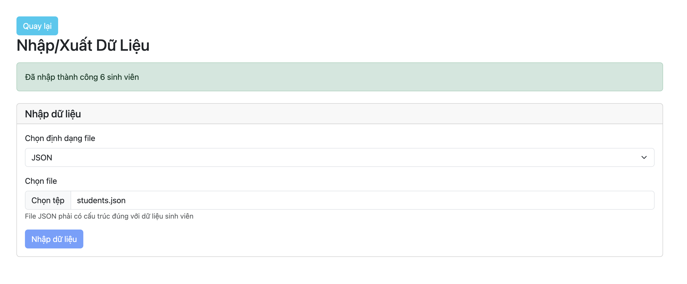

# Cách chạy chương trình:

## Cách chạy server Backend

- Tạo database trống ở MongoDB Atlas
- Truy cập vào folder backend, cài đặt các dependencies: **npm install**
- Tạo file **.env** như hướng dẫn.
- Khởi tạo database bằng lệnh: **node seed.js**
- Chạy server bằng lệnh: **npm run dev**

### Request body mẫu để tạo Student

```json
{
  "studentId": "21120585",
  "fullName": "Nguyễn Văn A",
  "dateOfBirth": "2002-05-15",
  "gender": "Nam",
  "faculty": "67dc02652ee5b77fb929f47a",
  "program": "67dc02652ee5b77fb929f486",
  "studentStatus": "67dc02652ee5b77fb929f480",
  "addresses": {
    "permanent": {
      "houseNumber": "123",
      "street": "Nguyễn Trãi",
      "district": "Thanh Xuân",
      "city": "Hà Nội",
      "country": "Việt Nam"
    },
    "temporary": {
      "houseNumber": "45",
      "street": "Lê Lợi",
      "district": "Hải Châu",
      "city": "Đà Nẵng",
      "country": "Việt Nam"
    },
    "mailing": {
      "houseNumber": "123",
      "street": "Nguyễn Trãi",
      "district": "Thanh Xuân",
      "city": "Hà Nội",
      "country": "Việt Nam"
    }
  },
  "idDocument": {
    "type": "CCCD",
    "idNumber": "123456789012",
    "issuedDate": "2015-06-20",
    "expiryDate": "2035-06-20",
    "issuedPlace": "Cục quản lý xuất nhập cảnh",
    "hasChip": true
  },
  "email": "nguyenvana@example.com",
  "phoneNumber": "0987654321",
  "nationality": "Việt Nam"
}
```

## Cách chạy server Frontend

### Cài đặt

1. Mở terminal và điều hướng đến thư mục frontend của dự án.
2. Chạy lệnh sau để cài đặt các phụ thuộc:
   ```sh
   npm install
   ```

### Chạy chương trình

1. Mở file frontend/ultis/api.js và thay BASE_URL là url của server backend (ví dụ: http://localhost:3000)
2. Để chạy ứng dụng ở chế độ phát triển, sử dụng lệnh:
   ```sh
   npm run dev
   ```
3. Mở trình duyệt và truy cập vào URL được cung cấp bởi terminal (thường là `http://localhost:5173`).

### Biên dịch

1.  Để biên dịch ứng dụng cho môi trường sản xuất, sử dụng lệnh:
    ```sh
    npm run build
    ```

## Hình ảnh minh hoạ tính năng

- Thêm sinh viên mới:
  [ADD-NEW-STUDENT](https://drive.google.com/file/d/12bm2igDFDUMIO5fb9F3xoHoDRyLnMLWO/view?usp=sharing)
- Xóa sinh viên:
  [DELETE-STUDENT](https://drive.google.com/file/d/1UYNcsLooTZ2X9my8amH0emtnqPaUjIDW/view?usp=sharing)
- Cập nhật thông tin sinh viên:
  [UPDATE-STUDENT](https://drive.google.com/file/d/1DfrFU6bRsa8KpmoEHDj0IPdvdUx0LOh2/view?usp=sharing)
- Tìm kiếm sinh viên:
  [SEARCH-STUDENT](https://drive.google.com/file/d/1BkgsIwPPkboWCbje2V7kZqGJQvyh2Ssd/view?usp=sharing)
- Cho phép đổi tên & thêm mới: khoa, tình trạng sinh viên, chương trình:
  [MANAGE-FACULTY](https://drive.google.com/file/d/1unebPH5v1kGXTA6aI4nB2ynR5X-2I9Dn/view?usp=sharing),
  [MANAGE-STUDENT-STATUS](https://drive.google.com/file/d/1aaMcZhb7DljRADF1DqAANpTwT3A371Ml/view?usp=sharing),
  [MANAGE-PROGRAM](https://drive.google.com/file/d/1KEIc-8wF4_WsxhmUB19149g1lNgL9Shr/view?usp=sharing)

- import JSON file:
  

- import CSV file: 
  

- export:
  

  - export JSON:
  

  - export CSV:
  