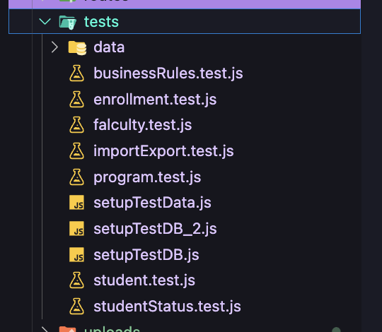
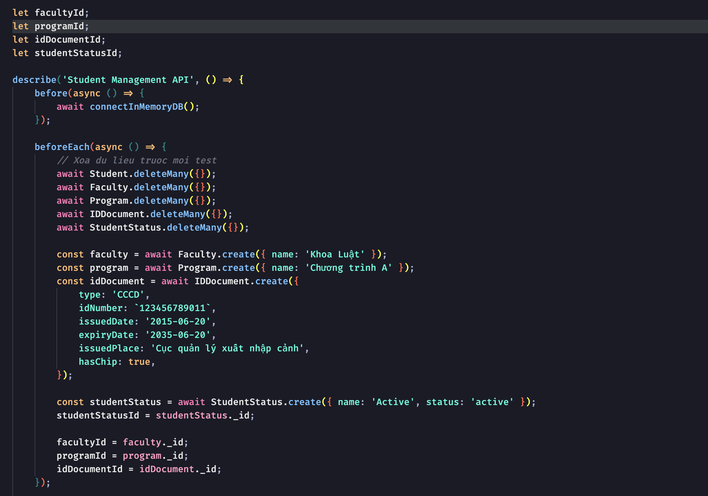
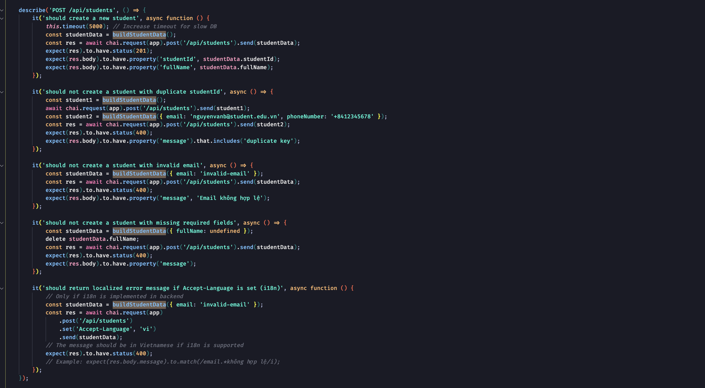
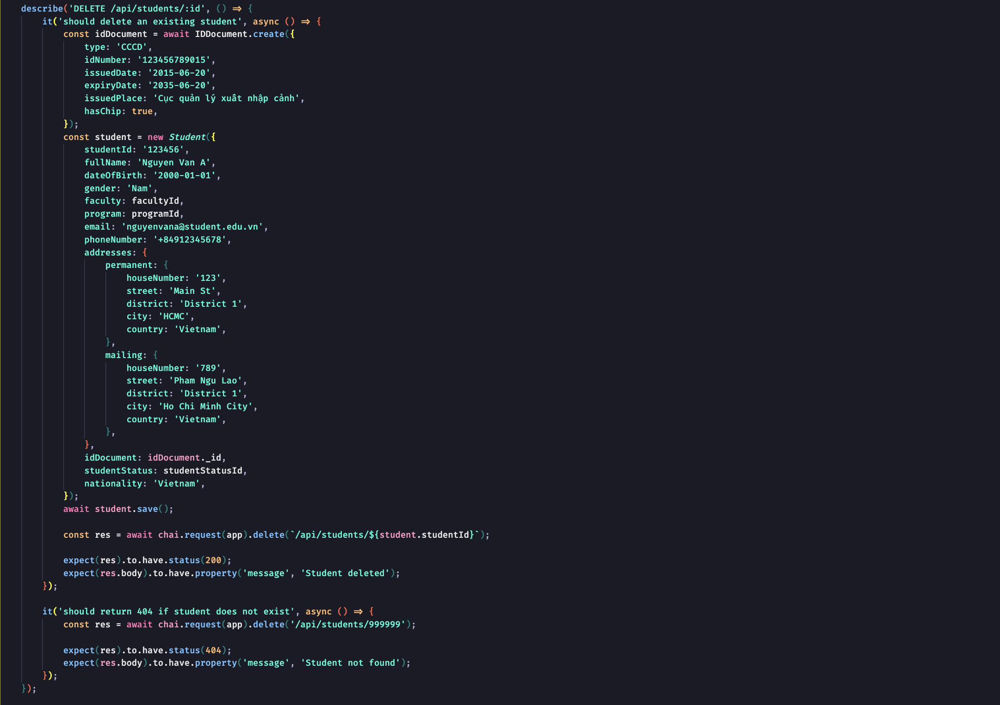
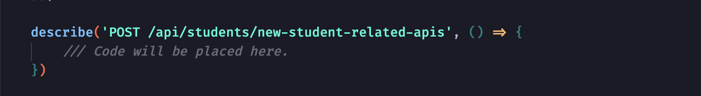
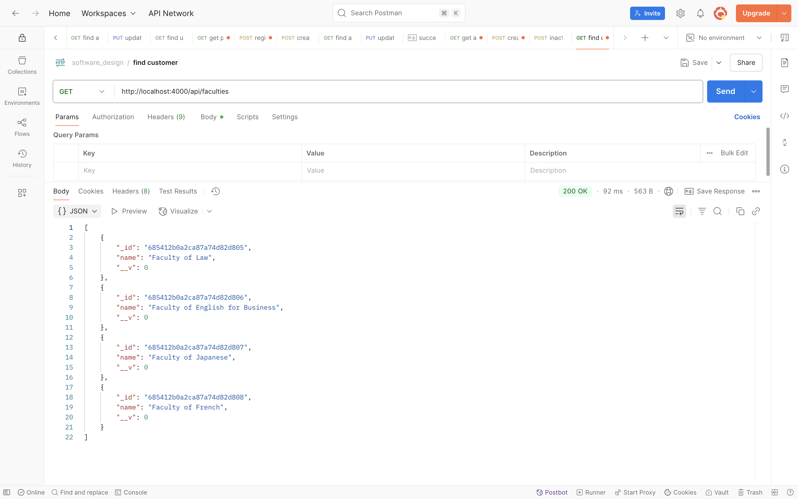
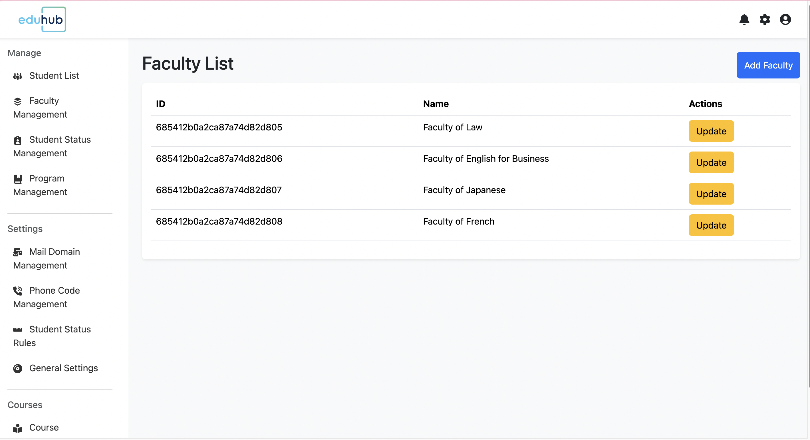

# Developer Guide

## 1. Coding Standards

- **JavaScript/Node.js:** Use the ESLint recommended rules. For frontend React code, additional React and React Hooks plugin rules are applied (see `frontend/eslint.config.js`).
- **Naming:** Use camelCase for variables/functions, PascalCase for classes, kebab-case for filenames.
- **Linting:** Use ESLint (see `frontend/eslint.config.js`).
- **Formatting:** Use Prettier for consistent formatting (if configured).
- **Comments:** Write clear, concise comments for complex logic.
- **Indentation:** 2 spaces.
- **Quotes:** Use single quotes for JS, double quotes for JSON.
- **Semicolons:** Always use semicolons.
- **Variable Naming:** Use descriptive names, avoid abbreviations.
- **Functions:** Use arrow functions for anonymous functions.
- **Comments:** Use JSDoc for functions and classes.
- **File Structure:** One class/component per file.
- **Imports:** Use ES6 import/export syntax.

**Example:**

```js
// Good
import express from "express";

/**
 * Get all students
 * @param {Request} req
 * @param {Response} res
 */
export const getAllStudents = async (req, res) => {
  // ...code...
};
```

---

## 2. Overview of Architecture

- **Backend:** Node.js, Express, MongoDB (Mongoose ODM).
- **Frontend:** Vite (React or other, if present).
- **Database**: MongoDB Atlas with Mongoose ODM
- **API:** RESTful endpoints for CRUD, import/export, business rules.
- **i18n:** Internationalization for error messages and entity names.
- **Testing:** Mocha + Chai for unit/integration tests.

---

## 3. Source Code Organization

### Project overall code organization

```
backend/
frontend/
docs/
  DEVELOPER_GUIDE.md
```

### Backend Structure

```
backend/
├── controllers/          # Business logic handlers
├── models/              # Mongoose data models
├── routes/              # API route definitions
├── middlewares/         # Custom middleware functions
├── validators/          # Input validation rules
├── utils/               # Utility functions (logger, i18n)
├── tests/               # Unit and integration tests
└── server.js           # Application entry point
```

### Frontend Structure

```
frontend/
├── src/
│   ├── components/      # Reusable UI components
│   ├── pages/          # Page-level components
│   ├── contexts/       # React context providers
│   ├── hooks/          # Custom React hooks
│   ├── i18n/           # Internationalization files
│   └── utils/          # Utility functions
└── public/             # Static assets
```

---

## 4. Getting Started with App Development

### Backend

1. **Clone the repository:**
   ```sh
   git clone <your-repo-url>
   cd Group10-Ex-TKPM/backend
   ```
2. **Install dependencies:**
   ```sh
   npm install
   ```
3. **Configure environment:**
   - Copy `.env.example` to `.env` and set `MONGODB_CONNECTION_STRING` and `PORT`.
4. **Seed the database:**
   ```sh
   node seed.js
   ```
5. **Run the backend server:**
   ```sh
   npm run dev
   ```
6. **Run tests:**
   ```sh
   npm test
   ```

### Frontend

1. **Install dependencies:**
   ```sh
   cd ../frontend
   npm install
   ```
2. **Configure environment:**
   - Copy `.env.example` to `.env` and set `VITE_API_URL`.
3. **Run the frontend:**
   ```sh
   npm run dev
   ```

---

## 5. Database Schema

### Overall description

- **MongoDB** is used with Mongoose models for `Student`, `Faculty`, `Program`, `IDDocument`, `StudentStatus`, `Enrollment`, etc.
- **Relationships:** Managed via ObjectId references (e.g., `faculty`, `program` in `Student`).
- **i18n:** Names for entities like `Faculty`, `Program`, `StudentStatus` are stored as `{ vi, en }` objects.

### Key Relationships

- Student → Faculty (Many-to-One)
- Student → Program (Many-to-One)
- Student → StudentStatus (Many-to-One)
- Class → Course (Many-to-One)
- Class → Semester (Many-to-One)
- Enrollment → Student + Class (Many-to-Many relationship table)

---

## 6. Updating an Existing Entity

**Step-by-step example: Add a `middleName` property to the `Student` model.**

1. **Update the Mongoose Schema**

   Open `backend/models/Student.js` and add the new property:

   ```js
   // ...existing code...
   const studentSchema = new mongoose.Schema({
     // ...existing fields...
     middleName: { type: String }, // <-- Add this line
     // ...existing fields...
   });
   // ...existing code...
   ```

2. **Update Data Validation (if needed)**

   If you want to validate `middleName`, update `backend/validators/student.validator.js`:

   ```js
   import { body } from "express-validator";
   // ...existing code...
   const validateMiddleName = body("middleName")
     .optional()
     .isString()
     .withMessage("Middle name must be a string");
   // Add to your validation chain
   ```

3. **Update Controllers**

   If you want to allow updating/creating this property, ensure your controller handles it:

   ```js
   // In createStudent and updateStudent, no change is needed if you use req.body destructuring.
   ```

4. **Update API Documentation**

   Add `middleName` to your API docs and sample requests.

5. **Update Tests**

   Add/modify tests in `backend/tests/student.test.js`:

   ```js
   it("should create a student with a middle name", async () => {
     const studentData = { ...validStudent, middleName: "Van" };
     const res = await chai
       .request(app)
       .post("/api/students")
       .send(studentData);
     expect(res.body).to.have.property("middleName", "Van");
   });
   ```

---

## 7. Registering New Routes

**Step-by-step example: Add a new route for managing departments.**

1. **Create a Model**

   `backend/models/Department.js`:

   ```js
   import mongoose from "mongoose";
   const departmentSchema = new mongoose.Schema({
     name: { type: String, required: true, unique: true },
   });
   export default mongoose.model("Department", departmentSchema);
   ```

2. **Create a Controller**

   `backend/controllers/department.controller.js`:

   ```js
   import Department from "../models/Department.js";
   export const getAllDepartments = async (req, res) => {
     const departments = await Department.find();
     res.json(departments);
   };
   // Add more CRUD methods as needed
   ```

3. **Create a Route File**

   `backend/routes/department.routes.js`:

   ```js
   import express from "express";
   import { getAllDepartments } from "../controllers/department.controller.js";
   const router = express.Router();
   router.get("/", getAllDepartments);
   export default router;
   ```

4. **Register the Route in the App**

   In `backend/server.js`:

   ```js
   import departmentRoutes from "./routes/department.routes.js";
   app.use("/api/departments", departmentRoutes);
   ```

5. **Test the New Route**

   Use Postman or write a test in `backend/tests/department.test.js`.

---


## 8. Inversion of Control and Dependency Injection


---

## 9. Data Validation

**How to add and use validation for a new or existing entity:**

1. **Create a Validator**

   `backend/validators/department.validator.js`:

   ```js
   import { body } from "express-validator";
   export const validateDepartment = [
     body("name")
       .trim()
       .notEmpty()
       .withMessage("Department name is required")
       .isLength({ min: 2 })
       .withMessage("Department name must be at least 2 characters"),
   ];
   ```

2. **Use the Validator in Routes**

   In `backend/routes/department.routes.js`:

   ```js
   import { validateDepartment } from "../validators/department.validator.js";
   import { validationResult } from "express-validator";

   router.post(
     "/",
     validateDepartment,
     (req, res, next) => {
       const errors = validationResult(req);
       if (!errors.isEmpty()) {
         return res.status(400).json({ errors: errors.array() });
       }
       next();
     },
     createDepartment
   );
   ```

3. **Test Validation**

   Add tests for invalid/valid data in your test file.

---

## 10. Exposing and Handling Events

- **Not used by default.**

---

## 11. Settings API

- Like any other website platform, EduHub has settings such as Email and Phone number formats.

- **Email/Phone Config:** Endpoints for managing allowed email domains and phone number formats.

   1. **Email Config**
      - location: `backend/routes/emailConfig.routes.js`
      - endpoints:
         - `GET /`: Get all email domains
         - `POST /`: Create a new email domain
         - `DELETE /:id`: Delete an existing email domain
   2. **Phone number config**
      - location: `backend/routes/phoneConfig.routes.js`
      - endpoints:
         - `GET /`: Get all phone number configs
         - `POST /`: Create a new phone number config
         - `DELETE /:id`: Delete an existing phone number config

---

## 12. Unit Testing

- I think everyone knows about the concept of UNIT tests. We know what UNIT tests are used for and agree that this is an important part of the process of developing reliable software. In this article, we won't discuss these issues. You can easily find all the necessary information on the Internet, for example, by following these links:

  - https://en.wikipedia.org/wiki/Unit_testing
  - https://docs.microsoft.com/dotnet/core/testing/unit-testing-best-practices
  - https://en.wikipedia.org/wiki/Test-driven_development

- In this developer guide, we will get acquainted with the features of testing in the project and learn how to add new tests. We won't test an abstract task but will write a full-fledged test for the existing functionality from scratch. At the end of the article, you will be provided with a reference to the appropriate commit with all described code changes.

- **Framework:** Mocha + Chai.
- **Location:** `backend/tests/`
- **How to run:** `npm test` in the `backend` folder.
- **Coverage:** CRUD, business rules, import/export, validation, i18n, edge cases.
- **Example files:** `student.test.js`, `importExport.test.js`, `businessRules.test.js`
- **Test data:** Use test data builders and seed scripts for isolation.

**Features Overview**



- In the screenshot, you can see the structure of the EduHub project. The folders such as backend.tests contain tests for the corresponding projects of the solution.
- Let's look at the student.test.js file for specific detail.
  
- This class will have some method to per setup before performing the some test cases.

   - before(async () => { await connectInMemoryDB(); }):
      - Purpose: Establishing a connection to the in-memory database before running all test cases.
      - Run one time before starting all test cases.
      - Create independent environment, so each test case will not be effected by the external factors.
      - Ensure that all test cases have connection to the database before it starts.

   - beforeEach(async () => { ... }):
      - Purpose: Prepare new data for each separate test case.
      - Clear all existing data to avoid interference between tests
      - Create new sample data (faculty, program, idDocument, studentStatus)
      - Store IDs of objects for use in tests
      - Ensure each test runs with the same initial state and independently

   - after(async () => { await disconnectInMemoryDB(); })
      - Purpose: Clean up resources after all tests are completed.
      - Disconnect from in-memory database
      - Free up system resources
      - Ensure there are no memory leaks after the test suite is finished.
   
   - function buildStudentData(overrides = {}):
      - Purpose: Create flexible student data templates for tests.
      - Provide a complete default student data structure
      - Allow customization of any field via overrides parameter
      - Reuse generated IDs (faculty, program, etc.)
      - Reduce code duplication (DRY - Don't Repeat Yourself) in test cases
      - Increase readability and maintainability of test code

- All testing methods are given below and as you can see there is nothing complicated in them:





- If you create some functionalities related to student, you can add new test cases in the student.test.js file.



---

## 13. How to Write a Plugin for Your App

- **Not supported by default.** If you add plugin support, document the plugin interface, registration, and lifecycle here.

---

## 14. Web API Documentation

## **Introduction**

- Web API for project provides access to all functions as well as full control over database entities.
- This project offers a suite of APIs that allow developers to use and extend the platform’s built-in features.
- These APIs allow developers to read and write data, interoperate with other systems and platforms, and add new functionality to this project.

## **Available Methods (method coverage)**

1. **Backend methods**

- The Web API Backend provides access to all project admin area functionality.
- Meaning, using the Web API Backend methods you can get full control over such functionality as student, deparment, falcuty, enrollment management, creating and updating these informations.

- **Endpoints:**  
  | Endpoint | Description |
  |---------------------------|------------------------------------------|
  | `/api/students` | Student management |
  | `/api/faculties` | Faculty management |
  | `/api/programs` | Program management |
  | `/api/student-statuses` | Student status management |
  | `/api/email-configs` | Email domain configuration |
  | `/api/phone-configs` | Phone number configuration |
  | `/api/status-transitions` | Student status transition configuration |
  | `/api/courses` | Course management |
  | `/api/classes` | Class management |
  | `/api/enrollments` | Enrollment management |

- **Request/Response:** See `backend/README.md` for sample request bodies.
- **i18n:** Use `?lang=vi` or `?lang=en` in query params for localized responses.
- **Error Handling:** Standardized error messages, status codes, and i18n support.

**Testing**

- The Developer mode is provided especially for the convenience of testing API endpoints. You can test the APIs using the following tools:
  - Frontend: Using the browser developer tools.
  - Postman: It is a tool for testing APIs.
- Below are instructions on how to use Postman to test several provided API endpoints.

**How to get all faculties with Postman**

- To get all faculties, follow these steps:

  1.  Open a new request tab by clicking the plus(+) button at the end of the tabs.
      Change the HTTP request method to "GET" using the dropdown selector on the left of the URL input field.
  2.  In the URL field, enter the authentication URL of your API: {storedURL}/api/faculties/.
  3.  Click the "Send" button. You should receive a "200 OK" response with the list of faculties in the response body.

  Here's a screenshot of Postman after the request is sent and the user has been authenticated:
  

**How to get all faculties with User Interface**

- To get all faculties, follow these steps:
  1.  Change current directory to frontend folder.
  ```sh
  cd ../frontend
  npm install
  ```
  2. Run the application.
  ```sh
  npm run dev
  ```
  3. Observe which port the application is running on. It should be 5173.
  - After, you can choose "Falcuty Management" in the sidebar or access to `http://localhost:5173/falcuty` in your browser.
    Here's a screenshot of UI after User has been navigated to the "Falcuty Management" page:
    

---

## 15. Additional Notes

- **Logger:** All major actions and errors are logged via `utils/logger.js`.
- **Import/Export:** Students can be imported/exported via CSV endpoints.
- **Business Rules:** Enforced in validators and controllers (e.g., allowed email domains, phone formats, status transitions).
- **Seed Data:** Use `seed.js` to initialize the database with test data.

---
